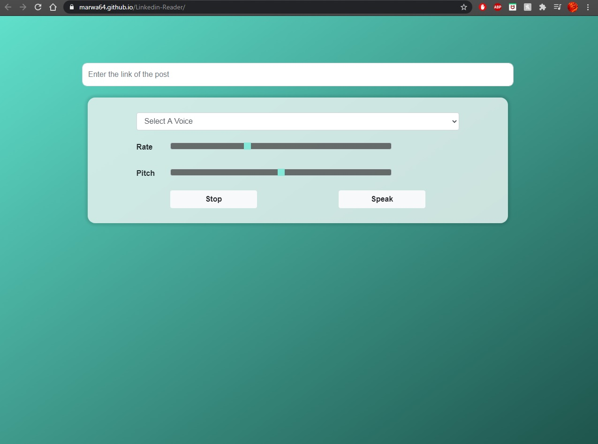

# Linkedin-Reader
Using the Speech Synthesis and Fetch api, this website reads the post and 2 comments from any Linkedin post you give it. You can also change the pitch and rate of the voice
reading.  
<b>Screenshots:</b>  
	
	

